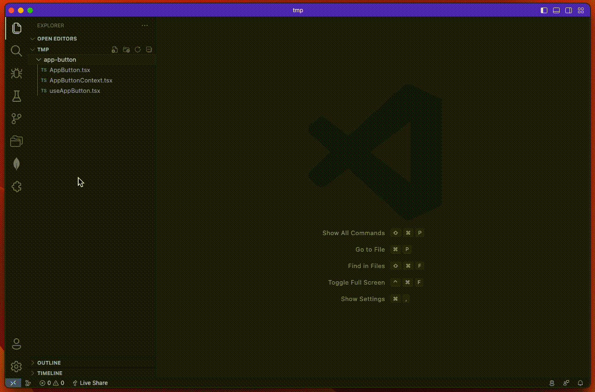
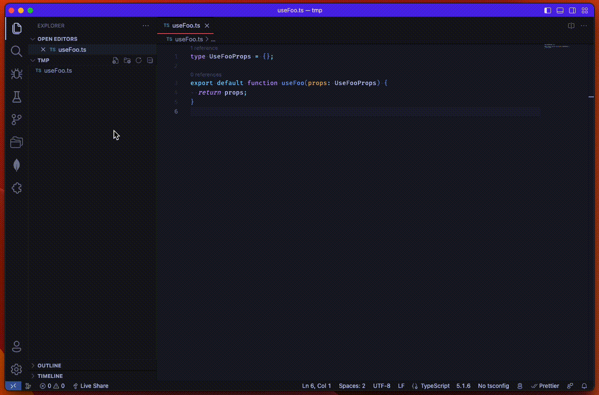

# vscode-ts-rename-all

Once rename a file or directory, then the filenames, dirnames and symbols are renamed in the same way.

## Usage

### Rename a directory

Select a directory in the explorer, then right-click > `TS Rename All: Rename...`.

### Rename a file

Select a file in the explorer, then right-click > `TS Rename All: Rename...`.

### Rename symbols

Open a TypeScript file, then Cmd + Shift + P > `TS Rename All: Rename symbols`.

